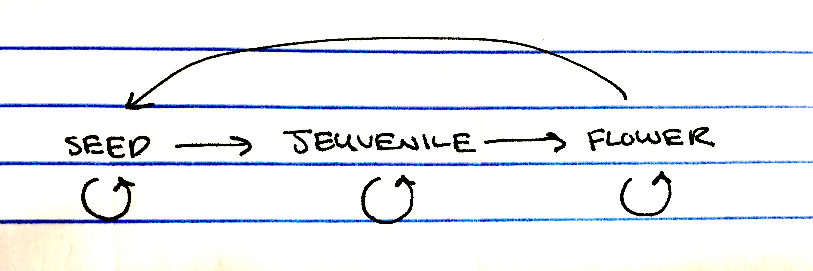

```{r setup, include=FALSE}
knitr::opts_chunk$set(echo = TRUE)
```

Popbio is a package built to model populaiton dynamics. It uses matrix population models to estimate a population's vital rates and build projection matrices. First, populaiton matrices need to be built using transition data collected from the field. Population matrices can be used to make predictions about how the population will change, given the data that was collected. Funtions in popbio will calculate lambda, w and v eigen vectors, sensativities and elasticities. 

So, lets get started...

My neighbor has planted a rose garden and I like is so much that I want to plant one too. However, I really don't love to garden and want to know what planting method will yeild the least effort on my part. In comes popbio to help you answer two questions: 

1. Given data I collect from my neighbor's garden, how will the population grow/shrink (find lambda)? 
2. What stages in the rose life cycle are most sensative/have the greatest impact on lambda?

First, construct a life history diagram:




Now build a leslie matrix and population vector:

```{r,echo=TRUE}
stages <- c("seed","jeuvenile","flowering")
A <- matrix(c(0.5, 0, 50, 0.1, 0.2, 0, 0, 0.6, 0.9), nrow=3, byrow=TRUE, dimnames=list(stages,stages))
A
n <- c(0,0,10) #start with planting 10 flowers -no jeuvenile or seeds in the seed bank
n
```

Use pop.projection to find lambda, the stabele stage distribution (w) and projections of population size. 

```{r,echo=TRUE}
library(popbio)
p <- pop.projection(A,n,iterations=15)
#takes in A and n, to get number of individuals after 1 year (t+1), does yhis over and over again (iterations) until stable stage distribution is met. 
p
p$lambda #annual population growth
p$stable.stage #stable stage distribution
p$stage.vector #by year 9 I'll have 900 plants, ridiculous! 
#plot stable stage distribution:
stage.vector.plot(p$stage.vectors,col=2:4)
#populaiton hasn't reached stable stage distribution -proportions are still fluctuating, so need to increase iterations to 15...
```

My rose garden will be out of control! So, what life stage or transition (vital rate) should I target to get my garden under control? 

Finding eigen vectors and sensativities: 

```{r,echo=TRUE}
eigA <- eigen.analysis(A)
eigA
eigA$stable.stage # w=stable stage distribution
eigA$repro.value # v=reproductive value/contribution to next generation
eigA$sensitivities # sensitivity matrix -if we change an element in matrix A by a small amount, but hold all other elements constant, what is the change in lambda?
eigA$elasticities #elasticities: effect of proportional change in vital rates on lambda., like sesitivities, but scaled so that they are demensionless (ie. make values for fecundity and survival more comparable). 
```

It looks like the seed to jeuvenile transition is more sensative. So I do a little research and find that seed germination is less successful in wet soils, so you plant your roses in a wet part of the garden:

```{r,echo=TRUE}
swampyA <- A
swampyA[2,1] <- 0.05 #instead of 10% germination/year, only 5%
swampyA
p2 <- pop.projection(swampyA, n, iterations=15)
p2
stage.vector.plot(p2$stage.vectors, col=2:4) 
#still an insane number of flowers!! and lambda is still too big
eigen.analysis(swampyA) #looks like jeuvenille to flowering stange will have large effect on lambda...
```

What if I do a little more research and find that jeuveniles prefer full sun, so I plant them in a shady part of the garden:

```{r, echo=TRUE}
shadyA <- swampyA
shadyA[3,2] <- 0.1 #10% move to flowering each year, rather than 60%
shadyA
p3 <- pop.projection(shadyA, n, iterations=15)
p3
stage.vector.plot(p3$stage.vectors, col=2:4) 
eigen.analysis(shadyA)

#much better! 

p$lambda
p2$lambda
p3$lambda
```

Looks like I'll be planting my roses in a shady swamp. 

