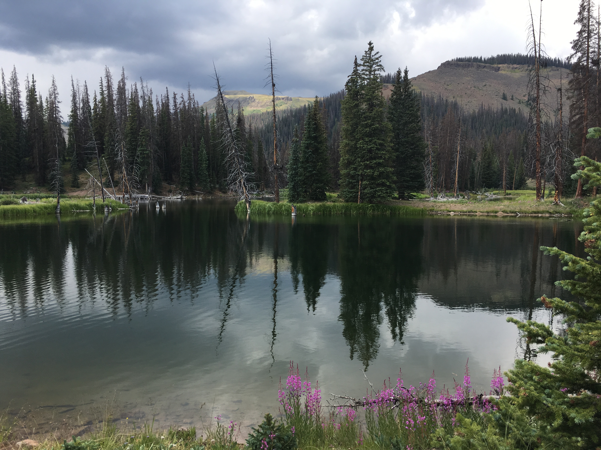

```{r setup, include=FALSE}
knitr::opts_chunk$set(echo = TRUE)
```



* Homework 1: [Bio 381 Repository Homepage](https://github.com/charliuden)

Interesting fact about myself: My two sisters and I all go by the male versions of our names: Alex, Harri and Charlie


* [Homework #2](Homework_2.html)


* Homework #3: [beamer presentation](Homework_3.pdf)

* [Homework #4](Homework_4.html)

* [Homework #5](Homework_5.html)

* [Homework #6](Lab6-Simulating&FittingDataDistributions.html)

* [Homework #7](Homework_7.html)

* [Homework #8](Homework_8.html)

* Homework #9 was added to #10

* [Homework #10](Homework_10.html)

* [Homework #11](Homework_11.html)


