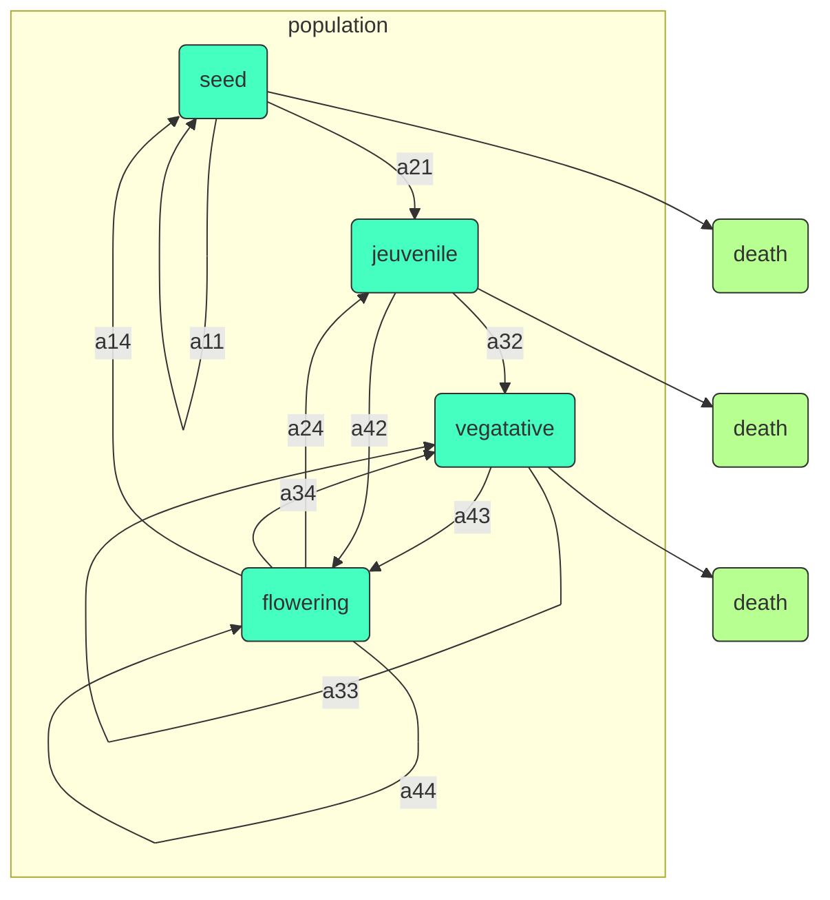

```mermaid
graph TB
subgraph population
A(seed)--a21-->B(jeuvenile)
B--a32-->C(vegatative)
C--a43-->D(flowering)
D--a44-->D
C--a33-->C
A--a11-->A
D--a24-->B
B--a42-->D
D--a34-->C
D--a14-->A

end

A-->E(death)
B-->F(death)
C-->G(death)

style A fill:#44ffbf, stroke:#333
style B fill:#44ffbf, stroke:#333
style C fill:#44ffbf, stroke:#333
style D fill:#44ffbf, stroke:#333


style E fill:#b6ff90, stroke:#333
style F fill:#b6ff90, stroke:#333
style G fill:#b6ff90, stroke:#333


```

Flow chart of potential outcomes at each stage of the centaurea life cycle. 